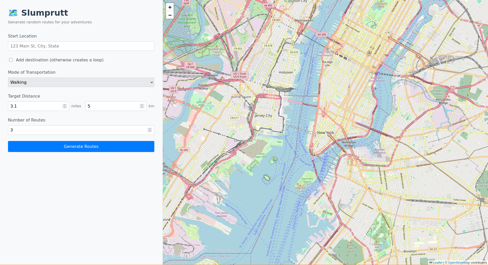
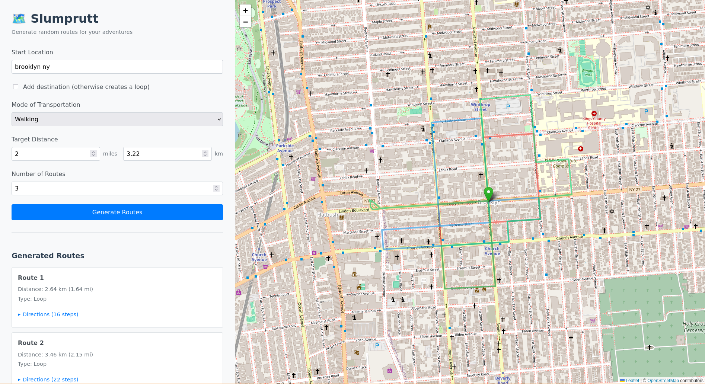
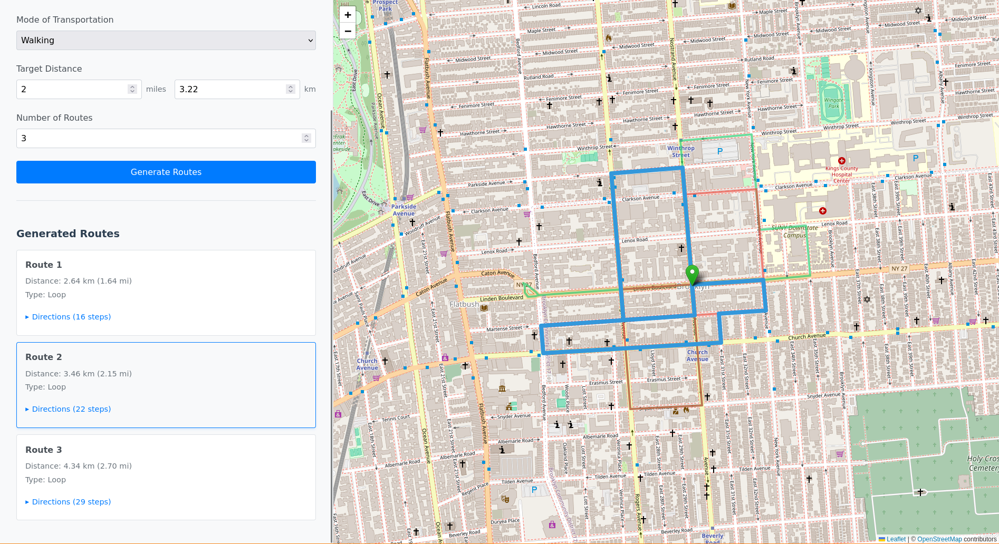
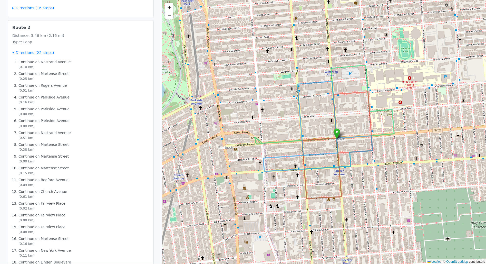

# Slumprutt 🗺️

Generate random walking, cycling, or driving routes for your next adventure.

## Screenshots






## Features

- **Random loop routes** - Start and end at the same location
- **Point-to-point routes** - Get from A to B via random paths
- **Distance targeting** - Specify desired route length in miles or km
- **Multiple transport modes** - Walking, cycling, or driving
- **Turn-by-turn directions** - Detailed step-by-step instructions
- **Real road routing** - Uses OpenStreetMap and OSRM for accurate paths

## Tech Stack

- **Backend**: TypeScript + Node.js + Express
- **Frontend**: Svelte + TypeScript + Leaflet
- **Routing**: OSRM (Open Source Routing Machine)
- **Maps**: OpenStreetMap

## Getting Started

### Backend

```bash
cd backend
npm install
npm run dev
```

Backend runs on http://localhost:3001

### Frontend

```bash
cd frontend
npm install
npm run dev
```

Frontend runs on http://localhost:5173

## Usage

1. Enter a start address
2. (Optional) Add a destination for point-to-point routes
3. Select transport mode (walk/bike/car)
4. Set desired distance
5. Choose number of routes (1-5)
6. Click "Generate Routes"
7. View routes on map and expand for turn-by-turn directions

## How It Works

1. Geocodes addresses using Nominatim (OpenStreetMap)
2. Generates random waypoints in a circular pattern (for loops) or between points
3. Sends waypoints to OSRM for road-accurate routing
4. Displays routes on an interactive Leaflet map
5. Provides step-by-step navigation instructions

## License

MIT

## Name

"Slumprutt" is Swedish for "random route" (slump = random/chance, rutt = route)
